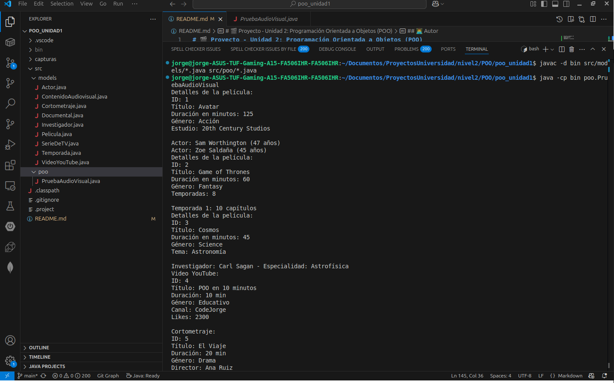
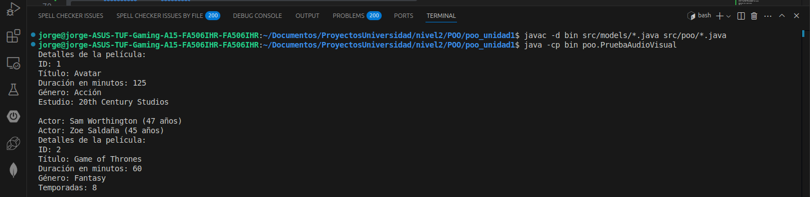

# 🎬 Proyecto - Unidad 2: Programación Orientada a Objetos (POO)

## 📌 Descripción del Proyecto

Este proyecto es una aplicación Java desarrollada como parte de la **Unidad 2 del curso de Programación Orientada a Objetos**. El objetivo es aplicar conceptos clave como:

- **Herencia**
- **Polimorfismo**
- **Abstracción**
- **Agregación**
- **Composición**
- **Asociación**

La aplicación simula el manejo de distintos tipos de contenido audiovisual como películas, series, documentales, videos de YouTube y cortometrajes. Cada tipo tiene atributos específicos, y el programa permite mostrarlos usando estructuras orientadas a objetos.

### ✨ Características principales

- Estructura organizada por paquetes (`models`, `poo`)
- Uso de clases abstractas y sobrescritura de métodos (`mostrarDetalles()`)
- Manejo de relaciones entre objetos:
  - `Pelicula` y `Actor` (Agregación)
  - `SerieDeTV` y `Temporada` (Composición)
  - `Documental` y `Investigador` (Asociación)
- Subclases especializadas: `VideoYouTube` y `Cortometraje`

---

## 🛠️ Instrucciones de instalación y uso

### 1. Clonar el repositorio

```bash
git clone https://github.com/tu_usuario/poo_unidad1.git
cd poo_unidad1
```

### 2. Estructura del proyecto

```
src/
├── models/
│   ├── Actor.java
│   ├── Pelicula.java
│   ├── SerieDeTV.java
│   ├── Temporada.java
│   ├── Documental.java
│   ├── Investigador.java
│   ├── VideoYouTube.java
│   ├── Cortometraje.java
│   └── ContenidoAudiovisual.java
├── poo/
│   └── PruebaAudioVisual.java
```

---

### 3. Compilación

#### Desde terminal (Linux o Windows WSL):

```bash
javac -d bin src/models/*.java src/poo/*.java
java -cp bin poo.PruebaAudioVisual
```

#### Desde Eclipse:

- Importar el proyecto como "Existing Java Project"
- Click derecho en `PruebaAudioVisual.java` → `Run As > Java Application`

#### Desde Visual Studio Code:

- Abrir `PruebaAudioVisual.java`
- Hacer clic en el botón `▶️` junto al método `main`

---

### Ejecución del programa desde terminal



Como se muestra en la imagen, el programa imprime los detalles de cada contenido audiovisual.

### 🧪 Comandos usados en terminal



Esta imagen muestra los comandos `javac` y `java` usados para compilar y ejecutar el programa manualmente desde terminal.

### 4. Ejemplo de uso (salida esperada)

```plaintext
Hello from Eclipse!
Detalles de la película:
ID: 0
Título: Avatar
Duración en minutos: 125
Género: Acción
Estudio: 20th Century Studios
Actor: Sam Worthington (47 años)
Actor: Zoe Saldaña (45 años)

Detalles de la película:
ID: 1
Título: Game of Thrones
Duración en minutos: 60
Género: Fantasy
Temporadas: 8
Temporada 1: 10 capítulos

Detalles de la película:
ID: 2
Título: Cosmos
Duración en minutos: 45
Género: Science
Tema: Astronomía
Investigador: Carl Sagan - Especialidad: Astrofísica

Video YouTube:
ID: 3
Título: POO en 10 minutos
Duración: 10 min
Género: Educativo
Canal: CodeJorge
Likes: 2300

Cortometraje:
ID: 4
Título: El Viaje
Duración: 20 min
Género: Drama
Director: Ana Ruiz

Detalles de la película:
ID: 5
Título: Interestelar
Duración en minutos: 169
Género: Ciencia Ficción
Estudio: Paramount Pictures
Actor: Matthew McConaughey (54 años)

Detalles de la película:
ID: 6
Título: Stranger Things
Duración en minutos: 50
Género: Misterio
Temporadas: 4
Temporada 2: 9 capítulos
```

---

## 👨‍💻 Autor

- **Jorge Rivera**
- Estudiante de Ingeniería de Software  
- Universidad Politécnica Salesiana